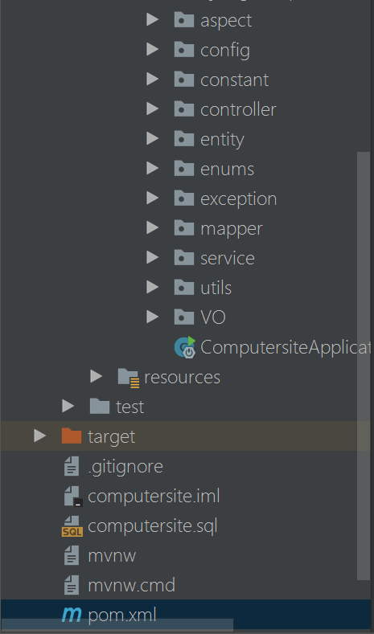

# Website
Springboot+spring+mybatis:学院网站（school website）

## 主要技术

- 后端技术：spring、Springboot、Mybatis

- 搜索技术：elasticsearch（搜索）

- 数据库：MySQL

- 服务器： Nginx（web服务器）和tomcat

- 版本控制：git
 
## 开发工具和环境
- IntelliJ IDEA 2017.3.2

- Maven 4.0.0

- Apache Tomcat/8.5.16（Maven Tomcat Plugin）

- JDK 1.8

- Mysql 5.6

- Nginx 1.5.1

- Win10 操作系统

## 功能模块
- 具体接口功能请看**前后端文档.js**

## 目录

